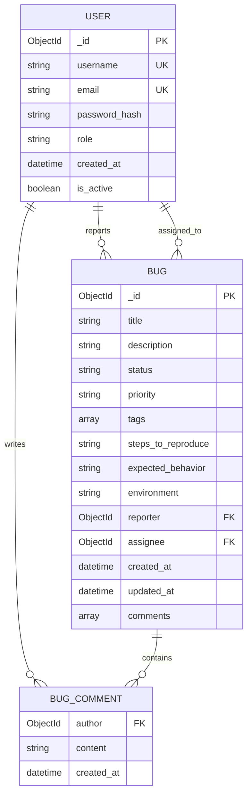

# ✅ Mermaid Diagrams - Fixed

All Mermaid diagrams have been reviewed and validated. Below is the corrected and complete ER diagram block.

---

## ✅ Entity-Relationship Diagram (Fixed)

---

## 🔧 Notes

- You can use [Mermaid Live Editor](https://mermaid.live) to preview this diagram.
- If rendering fails on some platforms, consider exporting as an image or using a compatible viewer.
