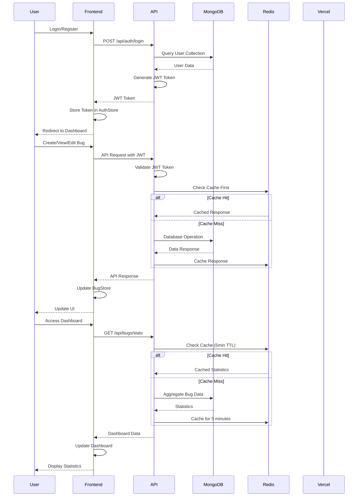
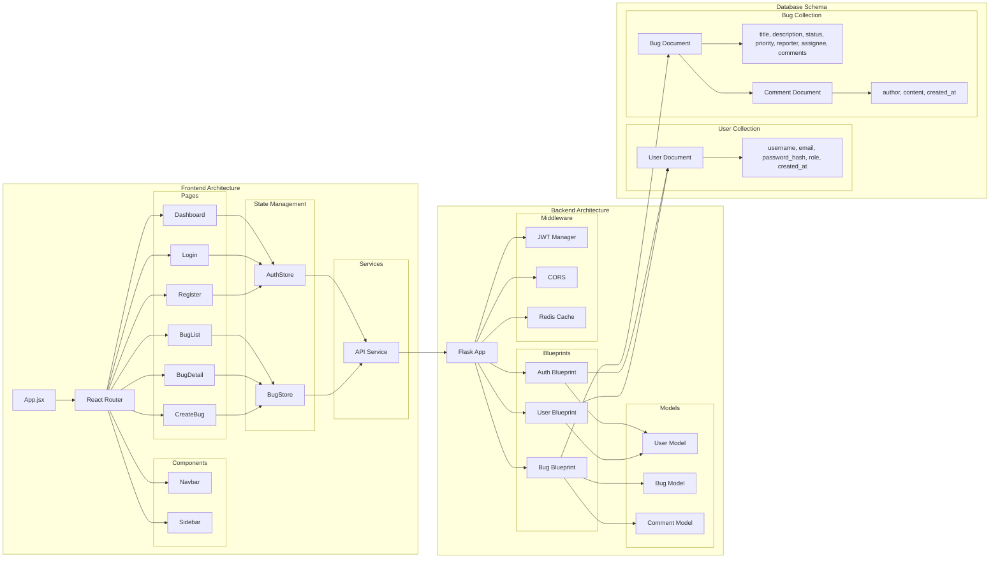
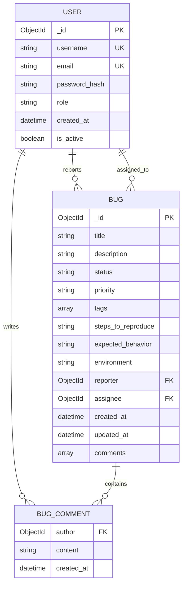

# Bug Tracker - Flask Web Application

A modern, responsive bug tracking system built with Flask, designed for efficient bug management and team collaboration.

## 🚀 Features

- **User Authentication**: Secure login/registration system
- **Bug Management**: Create, edit, assign, and track bugs
- **Status Tracking**: New, In Progress, Resolved, Closed
- **Priority Levels**: High, Medium, Low priority classification
- **Comment System**: Collaborative discussion on bugs
- **Dashboard**: Overview with statistics and recent activity
- **Responsive Design**: Mobile-friendly Bootstrap interface
- **Search & Filter**: Advanced filtering and search capabilities

## 🛠️ Technology Stack

- **Backend**: Python Flask with MongoDB (MongoEngine ODM)
- **Frontend**: React with Vite, Material-UI, Zustand
- **Database**: MongoDB Atlas (Cloud)
- **Cache**: Redis for API response caching
- **Deployment**: Vercel Serverless Functions
- **Development**: Docker & Docker Compose with multi-stage builds

## 📊 Project Architecture

```mermaid
graph TB
    %% User Interface Layer
    subgraph "User Interface Layer"
        UI[User Interface]
        UI --> |Accesses| Frontend
    end

    %% Frontend Layer
    subgraph "Frontend (React + Vite)"
        Frontend[React Application]
        
        subgraph "Frontend Components"
            Navbar[Navbar Component]
            Sidebar[Sidebar Component]
        end
        
        subgraph "Frontend Pages"
            Dashboard[Dashboard Page]
            BugList[Bug List Page]
            BugDetail[Bug Detail Page]
            CreateBug[Create Bug Page]
            Login[Login Page]
            Register[Register Page]
        end
        
        subgraph "Frontend State Management"
            AuthStore[Auth Store - Zustand]
            BugStore[Bug Store - Zustand]
        end
        
        subgraph "Frontend Services"
            APIService[API Service]
        end
        
        Frontend --> Navbar
        Frontend --> Sidebar
        Frontend --> Dashboard
        Frontend --> BugList
        Frontend --> BugDetail
        Frontend --> CreateBug
        Frontend --> Login
        Frontend --> Register
        Frontend --> AuthStore
        Frontend --> BugStore
        Frontend --> APIService
    end

    %% API Gateway Layer
    subgraph "API Gateway"
        Vercel[Vercel Serverless]
        Vercel --> |Routes to| API
    end

    %% Backend Layer
    subgraph "Backend (Flask API)"
        API[Flask Application]
        
        subgraph "API Routes"
            AuthRoutes[Auth Routes]
            BugRoutes[Bug Routes]
            UserRoutes[User Routes]
        end
        
        subgraph "API Models"
            UserModel[User Model]
            BugModel[Bug Model]
            BugCommentModel[Bug Comment Model]
        end
        
        subgraph "API Middleware"
            JWT[JWT Authentication]
            CORS[CORS Middleware]
            Cache[Redis Caching]
        end
        
        API --> AuthRoutes
        API --> BugRoutes
        API --> UserRoutes
        API --> UserModel
        API --> BugModel
        API --> BugCommentModel
        API --> JWT
        API --> CORS
        API --> Cache
    end

    %% Database Layer
    subgraph "Database Layer"
        MongoDB[(MongoDB Atlas)]
        
        subgraph "Collections"
            UsersCollection[Users Collection]
            BugsCollection[Bugs Collection]
        end
        
        MongoDB --> UsersCollection
        MongoDB --> BugsCollection
    end

    %% Cache Layer
    subgraph "Cache Layer"
        Redis[(Redis Cache)]
    end

    %% Deployment Layer
    subgraph "Deployment & Infrastructure"
        Docker[Docker & Docker Compose]
        
        subgraph "Containers"
            APIContainer[API Container]
            FrontendContainer[Frontend Container]
            RedisContainer[Redis Container]
        end
        
        subgraph "Deployment Scripts"
            LocalDeploy[local-deploy.sh]
            DeployScript[deploy.sh]
        end
        
        Docker --> APIContainer
        Docker --> FrontendContainer
        Docker --> RedisContainer
        Docker --> LocalDeploy
        Docker --> DeployScript
    end

    %% External Services
    subgraph "External Services"
        VercelDeploy[Vercel Deployment]
        MongoDBAtlas[MongoDB Atlas Cloud]
    end

    %% Connections
    UI --> Frontend
    Frontend --> |HTTP Requests| APIService
    APIService --> |API Calls| API
    API --> |Database Operations| MongoDB
    API --> |Cache Operations| Redis
    
    %% Deployment Connections
    Docker --> APIContainer
    Docker --> FrontendContainer
    Docker --> RedisContainer
    APIContainer --> API
    FrontendContainer --> Frontend
    RedisContainer --> Redis
    
    %% External Connections
    Vercel --> API
    MongoDB --> MongoDBAtlas

    %% Styling
    classDef frontendClass fill:#e1f5fe,stroke:#01579b,stroke-width:2px
    classDef backendClass fill:#f3e5f5,stroke:#4a148c,stroke-width:2px
    classDef databaseClass fill:#e8f5e8,stroke:#1b5e20,stroke-width:2px
    classDef deploymentClass fill:#fff3e0,stroke:#e65100,stroke-width:2px
    classDef externalClass fill:#fce4ec,stroke:#880e4f,stroke-width:2px

    class Frontend,Navbar,Sidebar,Dashboard,BugList,BugDetail,CreateBug,Login,Register,AuthStore,BugStore,APIService frontendClass
    class API,AuthRoutes,BugRoutes,UserRoutes,UserModel,BugModel,BugCommentModel,JWT,CORS,Cache backendClass
    class MongoDB,UsersCollection,BugsCollection,Redis databaseClass
    class Docker,APIContainer,FrontendContainer,RedisContainer,LocalDeploy,DeployScript deploymentClass
    class Vercel,VercelDeploy,MongoDBAtlas externalClass
```



## 🔄 Data Flow Architecture



## 🏗️ Component Architecture



## 🚀 Deployment Architecture

```mermaid
graph TB
    %% Development Environment
    subgraph "Development Environment"
        subgraph "Local Docker Setup"
            LocalAPI[API Container :5000]
            LocalFrontend[Frontend Container :3000]
            LocalRedis[Redis Container :6379]
        end
        
        subgraph "Local Files"
            LocalDeployScript[local-deploy.sh]
            DockerCompose[docker-compose.yml]
            DockerfileAPI[Dockerfile.api]
            DockerfileFrontend[Dockerfile.frontend]
        end
        
        LocalDeployScript --> DockerCompose
        DockerCompose --> LocalAPI
        DockerCompose --> LocalFrontend
        DockerCompose --> LocalRedis
        DockerCompose --> DockerfileAPI
        DockerCompose --> DockerfileFrontend
    end

    %% Production Environment
    subgraph "Production Environment"
        subgraph "Vercel Deployment"
            VercelAPI[Vercel Serverless API]
            VercelFrontend[Vercel Static Frontend]
        end
        
        subgraph "Cloud Services"
            MongoDBAtlas[MongoDB Atlas]
            VercelConfig[vercel.json]
        end
        
        VercelAPI --> MongoDBAtlas
        VercelFrontend --> VercelAPI
        VercelConfig --> VercelAPI
        VercelConfig --> VercelFrontend
    end

    %% Environment Variables
    subgraph "Configuration"
        subgraph "Environment Variables"
            SecretKey[SECRET_KEY]
            MongoUser[MONGO_USERNAME]
            MongoPass[MONGO_PASSWORD]
            MongoCluster[MONGO_CLUSTER]
            MongoDB[MONGO_DATABASE]
            RedisHost[REDIS_HOST]
            RedisPort[REDIS_PORT]
        end
        
        subgraph "Configuration Files"
            Requirements[requirements.txt]
            PackageJSON[package.json]
            ViteConfig[vite.config.js]
        end
    end

    %% Connections
    LocalAPI --> SecretKey
    LocalAPI --> MongoUser
    LocalAPI --> MongoPass
    LocalAPI --> MongoCluster
    LocalAPI --> MongoDB
    LocalAPI --> RedisHost
    LocalAPI --> RedisPort
    
    VercelAPI --> SecretKey
    VercelAPI --> MongoUser
    VercelAPI --> MongoPass
    VercelAPI --> MongoCluster
    VercelAPI --> MongoDB
    VercelAPI --> RedisHost
    VercelAPI --> RedisPort
    
    LocalFrontend --> PackageJSON
    LocalFrontend --> ViteConfig
    VercelFrontend --> PackageJSON
    VercelFrontend --> ViteConfig
    
    LocalAPI --> Requirements
    VercelAPI --> Requirements
```



## 🔧 API Endpoints Architecture

```mermaid
graph TD
    %% API Root
    API[Flask API]
    
    %% Auth Routes
    subgraph "Authentication Routes (/api/auth)"
        AuthLogin[POST /login]
        AuthRegister[POST /register]
        AuthLogout[POST /logout]
        AuthRefresh[POST /refresh]
    end
    
    %% Bug Routes
    subgraph "Bug Management Routes (/api/bugs)"
        BugList[GET / - List bugs]
        BugCreate[POST / - Create bug]
        BugGet[GET /:id - Get bug]
        BugUpdate[PUT /:id - Update bug]
        BugDelete[DELETE /:id - Delete bug]
        BugComment[POST /:id/comments - Add comment]
        BugStats[GET /stats - Get statistics]
    end
    
    %% User Routes
    subgraph "User Management Routes (/api/users)"
        UserProfile[GET /profile - Get profile]
        UserUpdate[PUT /profile - Update profile]
        UserList[GET / - List users]
        UserGet[GET /:id - Get user]
    end
    
    %% Health Check
    HealthCheck[GET /api/health]
    
    %% Connections
    API --> AuthLogin
    API --> AuthRegister
    API --> AuthLogout
    API --> AuthRefresh
    
    API --> BugList
    API --> BugCreate
    API --> BugGet
    API --> BugUpdate
    API --> BugDelete
    API --> BugComment
    API --> BugStats
    
    API --> UserProfile
    API --> UserUpdate
    API --> UserList
    API --> UserGet
    
    API --> HealthCheck
```



## 💾 Database Schema Architecture



## 📋 Prerequisites

- Docker and Docker Compose
- Python 3.11+ (for local development without Docker)
- Git

## 🚀 Quick Start with Docker

### 1. Clone and Setup
```bash
git clone <repository-url>
cd Ind-Project
```

### 2. Run Local Development
```bash
# Make the script executable (Linux/Mac)
chmod +x local-deploy.sh

# Start the application
./local-deploy.sh
```

### 3. Access the Application
- **URL**: http://localhost:5000
- **Admin Login**: 
  - Username: `admin`
  - Password: `admin123`

## 🐳 Docker Commands

```bash
# Start application
./local-deploy.sh

# Stop application
./local-deploy.sh stop

# View logs
./local-deploy.sh logs

# Restart application
./local-deploy.sh restart

# Open shell in container
./local-deploy.sh shell

# Clean up everything
./local-deploy.sh clean
```

## 💻 Local Development (Without Docker)

### 1. Setup Virtual Environment
```bash
python -m venv venv
source venv/bin/activate  # Linux/Mac
# or
venv\Scripts\activate     # Windows
```

### 2. Install Dependencies
```bash
pip install -r requirements.txt
```

### 3. Setup Environment Variables
```bash
cp .env.example .env
# Edit .env with your configuration
```

### 4. Initialize Database
```bash
python -c "from app import create_app; from models import db; app = create_app(); app.app_context().push(); db.create_all()"
```

### 5. Run Application
```bash
python app.py
```

## 🌐 Deployment to Vercel

### 1. Install Vercel CLI
```bash
npm install -g vercel
```

### 2. Deploy
```bash
vercel --prod
```

### 3. Configure Environment Variables
Set the following in Vercel dashboard:
- `SECRET_KEY`: Your secret key
- `DATABASE_URL`: PostgreSQL connection string
- `MAIL_SERVER`: SMTP server (optional)
- `MAIL_USERNAME`: SMTP username (optional)
- `MAIL_PASSWORD`: SMTP password (optional)

## 📁 Project Structure

```
Ind-Project/
├── api/                    # Vercel serverless functions
│   └── index.py
├── static/                 # Static assets
│   ├── css/
│   │   └── style.css
│   └── js/
│       └── main.js
├── templates/              # Jinja2 templates
│   ├── base.html
│   ├── home.html
│   ├── login.html
│   ├── register.html
│   ├── bug_form.html
│   ├── bug_detail.html
│   ├── bugs_list.html
│   └── report_bug.html
├── instance/               # Database and uploads
├── app.py                  # Flask application factory
├── models.py               # Database models
├── routes.py               # Application routes
├── forms.py                # WTForms definitions
├── config.py               # Configuration settings
├── wsgi.py                 # WSGI entry point
├── requirements.txt        # Python dependencies
├── vercel.json            # Vercel configuration
├── Dockerfile             # Docker configuration
├── docker-compose.yml     # Full Docker setup
├── docker-compose.dev.yml # Development Docker setup
├── nginx.conf             # Nginx configuration
└── local-deploy.sh        # Local deployment script
```

## 🔧 Configuration

### Environment Variables

| Variable | Description | Default |
|----------|-------------|---------|
| `FLASK_ENV` | Flask environment | `development` |
| `SECRET_KEY` | Flask secret key | Required |
| `DATABASE_URL` | Database connection string | `sqlite:///instance/bugtracker.db` |
| `MAIL_SERVER` | SMTP server | `localhost` |
| `MAIL_PORT` | SMTP port | `587` |
| `MAIL_USE_TLS` | Use TLS for email | `1` |
| `MAIL_USERNAME` | SMTP username | Optional |
| `MAIL_PASSWORD` | SMTP password | Optional |

### Database Models

- **User**: User authentication and profile
- **Bug**: Bug reports with status, priority, and metadata
- **BugComment**: Comments and discussions on bugs

## 🎨 Customization

### Styling
- Edit `static/css/style.css` for custom styles
- Modify Bootstrap variables in CSS
- Update `templates/base.html` for layout changes

### Functionality
- Add new routes in `routes.py`
- Create new forms in `forms.py`
- Extend models in `models.py`

## 🧪 Testing

```bash
# Run tests (when implemented)
python -m pytest

# Check code style
flake8 .

# Type checking
mypy .
```

## 📝 API Endpoints

| Endpoint | Method | Description |
|----------|--------|-------------|
| `/` | GET | Dashboard/Home page |
| `/login` | GET, POST | User login |
| `/register` | GET, POST | User registration |
| `/logout` | POST | User logout |
| `/bugs` | GET | List all bugs |
| `/bugs/new` | GET, POST | Create new bug |
| `/bugs/<id>` | GET | View bug details |
| `/bugs/<id>/edit` | GET, POST | Edit bug |
| `/bugs/<id>/comment` | POST | Add comment |
| `/api/stats` | GET | Bug statistics |

## 🤝 Contributing

1. Fork the repository
2. Create a feature branch
3. Make your changes
4. Add tests if applicable
5. Submit a pull request

## 📄 License

This project is licensed under the MIT License.

## 🆘 Support

For support and questions:
- Create an issue in the repository
- Check the documentation
- Review the Docker logs: `./local-deploy.sh logs`

## 🔄 Updates

To update the application:
1. Pull latest changes
2. Rebuild containers: `./local-deploy.sh clean && ./local-deploy.sh`
3. Check for database migrations if needed
